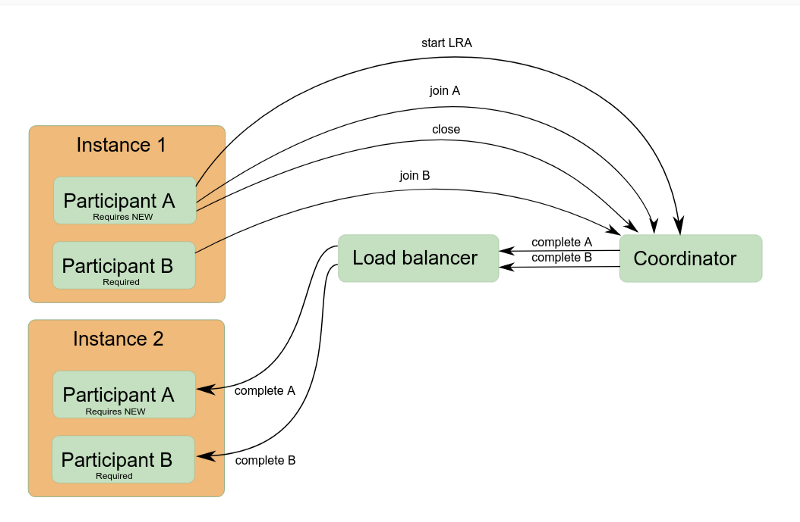
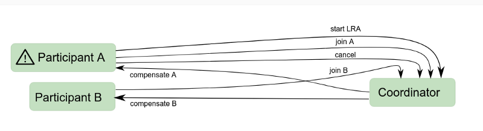
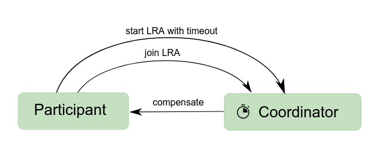
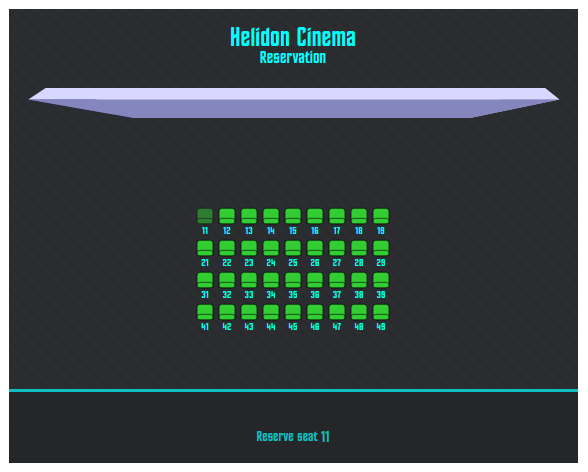
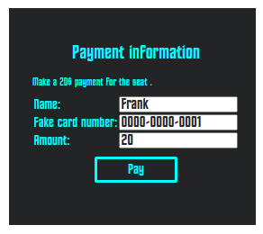
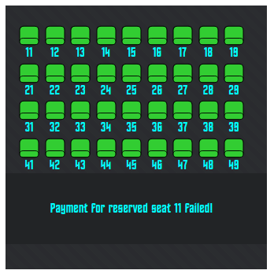
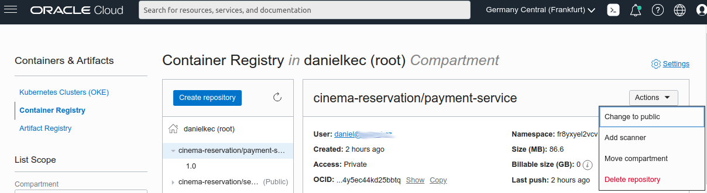

MicroProfile Long Running Actions (LRA) is a long-awaited specification that provides a lock-free, 
and consequently loosely-coupled, approach to achieve consistency in a microservice environment.

Long Running Actions follow the [SAGA pattern](https://en.wikipedia.org/wiki/Long-running_transaction), 
where asynchronous compensations are used for maintaining eventual data integrity without needing to stage expensive isolation. 
This method removes the additional burden of keeping an eye on your data integrity for great scalability, 
so valued in the world of microservices.

## LRA Transaction
Every LRA transaction can be joined by multiple participants. Participants are JAX-RS resources with methods annotated with LRA annotations, 
usually for joining `@LRA` and others to be called in case of compensating `@Compensate` or completing `@Complete` the transaction.

```java
@Path("/example")
@ApplicationScoped
public class LRAExampleResource {

    @PUT
    @LRA(value = LRA.Type.REQUIRES_NEW, timeLimit = 500, timeUnit = ChronoUnit.MILLIS)
    @Path("start-example")
    public Response startExample(@HeaderParam(LRA_HTTP_CONTEXT_HEADER) URI lraId, String data) {
        // Executed in the scope of new LRA transaction
        return Response.ok().build();
    }

    @PUT
    @Complete
    @Path("complete-example")
    public Response completeExample(@HeaderParam(LRA_HTTP_CONTEXT_HEADER) URI lraId) {
        // Called by LRA coordinator when startExample method sucessfully finishes
        return LRAResponse.completed();
    }

    @PUT
    @Compensate
    @Path("compensate-example")
    public Response compensateExample(@HeaderParam(LRA_HTTP_CONTEXT_HEADER) URI lraId) {
        // Called by LRA coordinator when startExample method throws exception or don't finish before time limit
        return LRAResponse.compensated();
    }
}
```
Every participant joining the LRA transaction needs to provide its compensation links, those URLs leading to resources annotated with
`@Compensate`, `@Complete`, `@AfterLRA` etc. LRA coordinator keeps track of which resources to call when the LRA transaction state changes. 
When the JAX-RS resource method is annotated with `@LRA(REQUIRES_NEW)`, every intercepted call starts a new LRA transaction within coordinator 
and joins it as new participant before the resource method is invoked. 
The id of the created LRA transaction is accessible in the resource method through `Long-Running-Action` header. 
When the resource method invocation successfully finishes, the LRA transaction is reported to coordinator as closed, 
and if participant has `@Complete` method, it is eventually invoked by coordinator again 
with the appropriate LRA id header with the complete method of all the other participants which joined this particular LRA transaction.



When a resource method finishes exceptionally, LRA is reported to coordinator as cancelled and coordinator calls
`@Compensate` method on all participants registered under that transaction.



When a transaction isn't closed before it's timeout is reached, 
coordinator cancels the transaction and calls the compensate endpoints of the all participants of the timed-out transaction.



## LRA Coordinator

Long Running Actions implementation in Helidon requires LRA coordinator for LRA orchestration across the cluster. 
This is an extra service so you will need to enable the LRA functionality in your cluster. 
LRA coordinator keeps track of which participant joined which LRA transaction 
and calls the participant's LRA compensation resources when LRA transaction completes or is cancelled.

Helidon supports:
* Narayana LRA Coordinator
* Experimental Helidon LRA Coordinator

### Narayana LRA Coordinator
Narayana is a well-known transaction manager 
with a long history of reliability in the field of distributed transactions built around Arjuna core. 
Narayana LRA coordinator brings support for Long Running Actions and is the first LRA coordinator on the market.

```shell
wget https://search.maven.org/remotecontent?filepath=org/jboss/narayana/rts/lra-coordinator-quarkus/5.11.1.Final/lra-coordinator-quarkus-5.11.1.Final-runner.jar \
-O narayana-coordinator.jar \
&& java -Dquarkus.http.port=8070 -jar narayana-coordinator.jar
```

### Experimental Helidon LRA Coordinator
Helidon brings its own coordinator that is easy to set up for development and testing purposes. 
While it is not recommended for usage in production, it is a great lightweight solution for testing your LRA resources.

```shell
docker build -t helidon/lra-coordinator https://github.com/oracle/helidon.git#:lra/coordinator/server
docker run -dp 8070:8070 --name lra-coordinator --network="host" helidon/lra-coordinator
```

---

Let's take a look at a specific use case.


## Online cinema booking system

Our hypothetical cinema needs an online reservation system. We will split it in the two scalable services: 
one for actual booking of the seat, and the second one for making the payment. 
Our services will be completely separated, integrated only through the REST API calls.

Our booking service is going to reserve the seat first. Reservation service will start a new LRA transaction 
and join it as a first transaction participant. All communication with LRA coordinator is done behind the scenes, 
and we can just access LRA ID assigned to the new transaction in our JAX-RS method as request header `Long-Running-Action`.
Note that LRA stays active after JAX-RS method finishes because 
[Lra#end](https://download.eclipse.org/microprofile/microprofile-lra-1.0/apidocs/org/eclipse/microprofile/lra/annotation/ws/rs/LRA.html#end--)
is set to `false`.

```java
    @PUT
    @Path("/create/{id}")
    // Create new LRA transaction which won't end after this JAX-RS method end
    // Time limit for new LRA is 30 sec
    @LRA(value = LRA.Type.REQUIRES_NEW, end = false, timeLimit = 30)
    @Produces(MediaType.APPLICATION_JSON)
    public Response createBooking(@HeaderParam(LRA.LRA_HTTP_CONTEXT_HEADER) URI lraId,
                                  @PathParam("id") long id,
                                  Booking booking) {

        // LRA ID assigned by coordinator is provided as artificial request header
        booking.setLraId(lraId.toASCIIString());

        if (repository.createBooking(booking, id)) {
            LOG.info("Creating booking for " + id);
            return Response.ok().build();
        } else {
            LOG.info("Seat " + id + " already booked!");
            return Response
                    .status(Response.Status.CONFLICT)
                    .entity(JSON.createObjectBuilder()
                            .add("error", "Seat " + id + " is already reserved!")
                            .add("seat", id)
                            .build())
                    .build();
        }
    }
```



When a seat is successfully reserved, payment service is going to be called under the same LRA transaction. 
Artificial header `Long-Running-Action` is present in the response, so we can even access it on the client.

```javascript
    reserveButton.click(function () {
        selectionView.hide();
        createBooking(selectedSeat.html())
            .then(res => {
                if (res.ok) {
                    // Notice how we can access LRA ID even on the client side
                    let lraId = res.headers.get("Long-Running-Action");
                    paymentView.attr("data-lraId", lraId);
                    paymentView.show();
                } else {
                    res.json().then(json => {
                        showError(json.error);
                    });
                }
            });
    });
```
We can call other backend resources with same LRA transaction, just by setting `Long-Running-Action` again.
```javascript
    function makePayment(cardNumber, amount, lraId) {
        return fetch('/booking/payment', {
            method: 'PUT',
            headers: {
                'Content-Type': 'application/json',
                'Long-Running-Action': lraId
            },
            body: JSON.stringify({"cardNumber": cardNumber, "amount": amount})
        })
    }
```


Backend calls different service over JAX-RS client, 
we don't need to set `Long-Running-Action` header to propagate LRA transaction - as with JAX-RS clients, 
LRA implementation will do that for us automatically.

```java
    @PUT
    @Path("/payment")
    // Needs to be called within LRA transaction context
    // Doesn't end LRA transaction
    @LRA(value = LRA.Type.MANDATORY, end = false)
    @Produces(MediaType.APPLICATION_JSON)
    public Response makePayment(@HeaderParam(LRA.LRA_HTTP_CONTEXT_HEADER) URI lraId,
                                JsonObject jsonObject) {
        LOG.info("Payment " + jsonObject.toString());
        // Notice that we don't need to propagate LRA header
        // When using JAX-RS client, LRA header is propagated automatically
        ClientBuilder.newClient()
                .target("http://payment-service:7002")
                .path("/payment/confirm")
                .request()
                .rx()
                .put(Entity.entity(jsonObject, MediaType.APPLICATION_JSON))
                .whenComplete((res, t) -> {
                    if (res != null) {
                        LOG.info(res.getStatus() + " " + res.getStatusInfo().getReasonPhrase());
                        res.close();
                    }
                });
        return Response.accepted().build();
    }
```
Payment service will join transaction as another participant. 
Any card number other than `0000-0000-0000` will cancel LRA transaction. 
Finishing the resource method is going to complete LRA transaction because
[Lra#end](https://download.eclipse.org/microprofile/microprofile-lra-1.0/apidocs/org/eclipse/microprofile/lra/annotation/ws/rs/LRA.html#end--)
is set to `true`.

```java
    @PUT
    @Path("/confirm")
    // This resource method ends/commits LRA transaction as successfully completed
    @LRA(value = LRA.Type.MANDATORY, end = true)
    @Produces(MediaType.APPLICATION_JSON)
    @Consumes(MediaType.APPLICATION_JSON)
    public Response makePayment(@HeaderParam(LRA.LRA_HTTP_CONTEXT_HEADER) URI lraId,
                                Payment payment) {
        if (!payment.cardNumber.equals("0000-0000-0000")) {
            LOG.warning("Payment " + payment.cardNumber);
            throw new IllegalStateException("Card " + payment.cardNumber + " is not valid! "+lraId);
        }
        LOG.info("Payment " + payment.cardNumber+ " " +lraId);
        return Response.ok(JSON.createObjectBuilder().add("result", "success").build()).build();
    }
```
If payment operation fails or times out, LRA transaction is going to be cancelled and all participants 
are going to be notified through the compensation links provided during joining. 
In practice that means that LRA coordinator is going to call the method annotated with `@Compensate` 
with LRA id as a parameter. That is all we need in our booking service to clear the seat reservation 
to make it available for another, hopefully more solvent customer.

```java
    @Compensate
    public Response paymentFailed(URI lraId) {
        LOG.info("Payment failed! " + lraId);
        repository.clearBooking(lraId)
                .ifPresent(booking -> {
                    LOG.info("Booking for seat " + booking.getSeat().getId() + "cleared!");
                    Optional.ofNullable(sseBroadcaster)
                            .ifPresent(b -> b.broadcast(new OutboundEvent.Builder()
                                    .data(booking.getSeat())
                                    .mediaType(MediaType.APPLICATION_JSON_TYPE)
                                    .build())
                            );
                });
        return Response.ok(ParticipantStatus.Completed.name()).build();
    }
```


A sample Cinema Booking project leveraging LRA is available on GitHub:

[danielkec/helidon-lra-example](https://github.com/danielkec/helidon-lra-example)

It is a set of few simple K8s services prepared for deployment to
[Oracle Kubernetes Engine](https://docs.oracle.com/en-us/iaas/Content/ContEng/Concepts/contengoverview.htm) 
or locally to [Minikube](https://minikube.sigs.k8s.io/docs/). 

### Deploy to minikube
Prerequisites:
* Installed and started minikube
* Environment with 
[minikube docker daemon](https://minikube.sigs.k8s.io/docs/handbook/pushing/#1-pushing-directly-to-the-in-cluster-docker-daemon-docker-env) - `eval $(minikube docker-env)`

#### Build images
As we work directly with 
[minikube docker daemon](https://minikube.sigs.k8s.io/docs/handbook/pushing/#1-pushing-directly-to-the-in-cluster-docker-daemon-docker-env)
all we need to do is build the docker images.
```shell
bash build.sh;
```
Note that the first build can take few minutes for all the artifacts to download. 
Subsequent builds are going to be much faster as the layer with dependencies gets cached.

#### Deploy to minikube
```shell
bash deploy-minikube.sh
```
Script recreates whole namespace, any previous state of the `cinema-reservation` is obliterated. 
Deployment is exposed via NodePort and URL with port is printed at the end of the output:
```shell
namespace "cinema-reservation" deleted
namespace/cinema-reservation created
Context "minikube" modified.
service/booking-db created
service/lra-coordinator created
service/payment-service created
service/seat-booking-service created
deployment.apps/booking-db created
deployment.apps/lra-coordinator created
deployment.apps/payment-service created
deployment.apps/seat-booking-service created
service/cinema-reservation exposed
Application cinema-reservation will be available at http://192.168.99.107:31584
```

### Deploy to OCI OKE cluster
Prerequisites:
* [OKE k8s cluster](https://docs.oracle.com/en/learn/container_engine_kubernetes)
* OCI Cloud Shell with git, docker and kubectl configured for access OKE cluster
  
#### Pushing images to your OCI Container registry
The first thing you need is a place to push your docker images to so OKE k8s have a location to pull from.
[Container registry](https://docs.oracle.com/en-us/iaas/Content/Registry/Concepts/registryprerequisites.htm#Availab)
is part of your OCI tenancy so to be able to push in it you just need to
`docker login <REGION_KEY>.ocir.io` in it.
Username of the registry is `<TENANCY_NAMESPACE>/joe@acme.com` 
where `joe@acme.com` is your OCI user. 
Password will be [auth token](https://docs.oracle.com/en-us/iaas/Content/Registry/Tasks/registrygettingauthtoken.htm) 
of your `joe@acme.com`
To get your region key and tenancy namespace just execute following cmd in your OCI Cloud Shell:

```shell
# Get tenancy namespace and container registry
echo "" && \
echo "Container registry: ${OCI_CONFIG_PROFILE}.ocir.io" && \
echo "Tenancy namespace: $(oci os ns get --query "data" --raw-output)" && \
echo "" && \
echo "docker login ${OCI_CONFIG_PROFILE}.ocir.io" && \
echo "Username: $(oci os ns get --query "data" --raw-output)/joe@acme.com" && \
echo "Password: --- Auth token for user joe@acme.com" && \
echo ""
```
Example output:
```shell
Container registry: eu-frankfurt-1.ocir.io
Tenancy namespace: fr8yxyel2vcv

docker login eu-frankfurt-1.ocir.io
Username: fr8yxyel2vcv/joe@acme.com
Password: --- Auth token for user joe@acme.com
```
Save your container registry, tenancy namespace and auth token for later.

When your local docker is logged in to OCI Container Registry, you can execute `build-oci.sh`
with container registry and tenancy namespace as the parameters.

Example:
```shell
bash build-oci.sh eu-frankfurt-1.ocir.io fr8yxyel2vcv
```
Example output:
```shell
docker build -t eu-frankfurt-1.ocir.io/fr8yxyel2vcv/cinema-reservation/payment-service:1.0 .
...
docker push eu-frankfurt-1.ocir.io/fr8yxyel2vcv/cinema-reservation/seat-booking-service:1.0
...
docker build -t eu-frankfurt-1.ocir.io/fr8yxyel2vcv/cinema-reservation/seat-booking-service:1.0 .
...
docker push eu-frankfurt-1.ocir.io/fr8yxyel2vcv/cinema-reservation/payment-service:1.0
...
```
The script will print out docker build commands before executing them. 
Note that the first build can take few minutes for all the artifacts to download. 
Subsequent builds are going to be much faster as the layer with dependencies gets cached.

To make your pushed images publicly available, open your OCI console
**Developer Tools**>**Containers & Artifacts**>
[**Container Registry**](https://cloud.oracle.com/registry/containers/repos)
and set both repositories to **Public**



#### Deploy to OKE
You can use freshly cloned helidon-lra-example repository in OCI Cloud shell as all you need are the k8s descriptors. 
Your changes are built to the images you have pushed in the previous step.

In the OCI Cloud shell: 
```shell
git clone https://github.com/danielkec/helidon-lra-example.git
cd helidon-lra-example
bash deploy-oci.sh

kubectl get services
```
Example output:
```shell
NAME                         TYPE           CLUSTER-IP      EXTERNAL-IP   PORT(S)          AGE
booking-db                   ClusterIP      10.96.118.249   <none>        3306/TCP         34s
lra-coordinator              NodePort       10.96.114.48    <none>        8070:32434/TCP   33s
oci-load-balancing-service   LoadBalancer   10.96.170.39    <pending>     80:31192/TCP     33s
payment-service              NodePort       10.96.153.147   <none>        8080:30842/TCP   32s
seat-booking-service         NodePort       10.96.54.129    <none>        8080:32327/TCP   32s
```

You can see that right after deployment EXTERNAL-IP of the external LoadBalancer reads as `<pending>`
because OCI is provisioning it for you. But if you invoke `kubectl get services` a little later, 
then it will give you an external IP address with Helidon Cinema example exposed on port 80.

## Conclusion
Keeping integrity in distributed systems with compensation logic isn't a new idea, 
but can be quite complicated to achieve without special tooling.
*MicroProfile Long Running Actions* is exactly that, 
tooling that hides the complexities so you can focus on business logic.

We are already working on additional exciting features, 
like compatibility with other LRA coordinators or support of LRA context in messaging.

So stay tuned and happy coding!

### Resources
* [Helidon LRA documentation](https://helidon.io/docs/v2/#/mp/lra/01_introduction)
* [MicroProfile Long Running Actions Specification](https://download.eclipse.org/microprofile/microprofile-lra-1.0/microprofile-lra-spec-1.0.html)
* [Narayana LRA coordinator](https://narayana.io/lra/)
* [Online Cinema Booking example project](https://github.com/danielkec/helidon-lra-example)