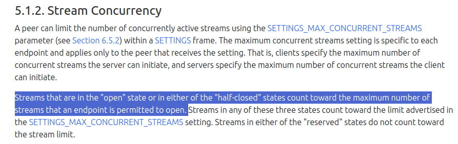
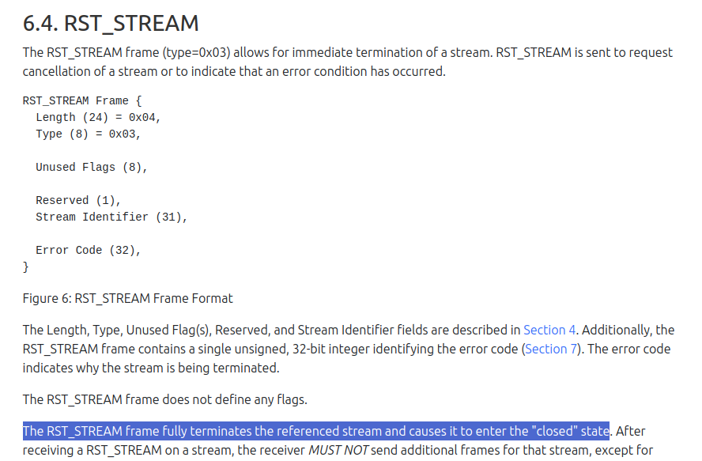

Just at the end of the summer, the largest DDoS attacks in internet history happened. Without gaining much of publicity, attacks were targeted at the three large cloud providers:  [Cloudflare](https://blog.cloudflare.com/technical-breakdown-http2-rapid-reset-ddos-attack/), [Google](https://cloud.google.com/blog/products/identity-security/google-cloud-mitigated-largest-ddos-attack-peaking-above-398-million-rps/) and [AWS](https://aws.amazon.com/blogs/security/how-aws-protects-customers-from-ddos-events/).

After some time, on October 10th, a new zero-day vulnerability in HTTP/2 protocol was disclosed as [CVE-2023-44487](https://nvd.nist.gov/vuln/detail/CVE-2023-44487) allowing DDoS attack quickly nicknamed as **HTTP/2 Rapid-Reset**.

As the vulnerability is in the HTTP/2 specification itself, the attack is threatening more or less, depending on the design and all the runtimes supporting HTTP/2 protocol.

The attack is fairly simple: HTTP/2 client can legally create millions and millions of requests(streams) over a single connection without using as many resources as the server. The server, on the other hand, is required by the spec to invest un-proportionally more resources in the bureaucracy of receiving those.

## "Why nobody thought of that?" 
Well, the spec gives runtimes the means to defend themselves with `MAX_CONCURRENT_STREAMS`
setting. The server can simply instruct the client how many of the streams can be opened at once, see
[5.1.2](https://httpwg.org/specs/rfc9113.html#rfc.section.5.1.2).



The problem is that the spec also gives the client the right to cancel the stream very quickly with
`RST_STREAM` frame at any time. And that is the problem right there. See [6.4](https://httpwg.org/specs/rfc9113.html#rfc.section.6.4).



Because the client can force the server to set up a new stream and reset/cancel the stream immediately(hence the
 `Rapid-Reset Attack` name), a large asymmetry happens between the server and the client. 
The server needs to parse the headers, allocate necessary resources for the new stream and release 
it all while the client doesn't really need to do much. In the saved time client can send the same 
headers again and again, accompanied by an immediate reset frame.

This simplicity makes Rapid-Reset very easy to do and hard to defend without breaking the specification rules.

# Helidon
**HTTP/2 support in all versions of Helidon needs to be explicitly enabled.**
Helidon supports HTTP/2 in versions 4.x, 3.x and experimentally in 2.x and 1.x.

## Helidon 4
Helidon 4 has HTTP/2 support disabled by default. To enable HTTP/2 a single dependency is needed:
```xml
<dependency>
    <groupId>io.helidon.webserver</groupId>
    <artifactId>helidon-webserver-http2</artifactId>
</dependency>
```

Helidon 4 HTTP/2 server is fixed in release [4.0.0](https://github.com/helidon-io/helidon/releases/tag/4.0.0)
with a token bucket for rapid resets, sending `GO_AWAY`
and closing connection when the threshold is reached.
No action is needed; protection against rapid reset attacks is active by default for HTTP/2 server.

By default, `100` rapid resets per `10` seconds are allowed. 
You can fine-tune the rapid reset defence with the following settings:
```yaml
server:
  port: 8080
  host: localhost

  protocols:
    http_2:
      rapid-reset-check-period: PT10S # 10 seconds in ISO_8601 Duration format
      max-rapid-resets: 100           # max 100 requests with rapid resets 
```

With SE, the same settings are available over programmatic API:
```java
Server server = Server.builder()
        .addProtocol(Http2Config.builder()
              .rapidResetCheckPeriod(Duration.of(10, ChronoUnit.SECONDS))
              .maxRapidResets(100)
              .build())
        .host("localhost")
        .port(8080)
        .routing(...)
        .build()
        .start();
```

## Helidon 3
Helidon 3 has HTTP/2 support disabled by default. To enable HTTP/2, a single dependency is needed:

```xml
<dependency>
    <groupId>io.helidon.webserver</groupId>
    <artifactId>helidon-webserver-http2</artifactId>
</dependency>
```

Unlike Helidon 4, Helidon 3.x is built on top of the Netty library and relies on an upstream
[patch](https://github.com/netty/netty/commit/58f75f665aa81a8cbcf6ffa74820042a285c5e61) in [Netty 4.1.100.Final](https://netty.io/news/2023/10/10/4-1-100-Final.html).The patched version of Netty allows `200` resets per `30` second window.
Netty upgrade to the patched version is part of [Helidon 3.2.3 release](https://github.com/helidon-io/helidon/releases/tag/3.2.3).

⚠️ Upgrade to [Helidon 3.2.3](https://github.com/helidon-io/helidon/releases/tag/3.2.3) as soon as possible in case your server has HTTP/2 enabled!

## Helidon 2 and 1
Both versions of Helidon 2 and 1 have HTTP/2 support disabled by default.

To enable HTTP/2, an experimental feature needs to be enabled:
```yaml
server:
  port: 8080
  host: localhost
  experimental:
    http2:
      enable: true
      max-content-length: 16384
```

Helidon versions 2 and 1 are built on top of the Netty library and rely on the upstream 
[patch](https://github.com/netty/netty/commit/58f75f665aa81a8cbcf6ffa74820042a285c5e61) in `Netty 4.1.100.Final`.
Netty upgrade to the patched version is part of [Helidon 2.6.4 release](https://github.com/helidon-io/helidon/releases/tag/2.6.4)

⚠️ Upgrade to [Helidon 2.6.4](https://github.com/helidon-io/helidon/releases/tag/2.6.4) as soon as possible in case your server has HTTP/2 enabled!

# Conclusion
Remember **HTTP/2 support in all versions of Helidon needs to be explicitly enabled**.
On October 10th, the clock started to tick for a large part of the internet to patch or 
update all vulnerable HTTP/2 infrastructure as fast as possible.

In case you are using HTTP/2, update to the patched version of Helidon as soon as possible.

