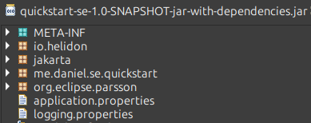
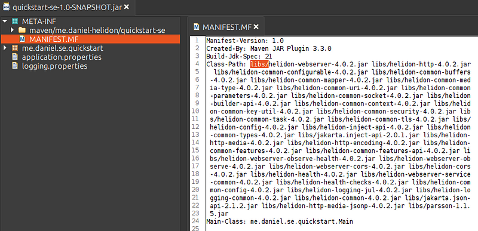
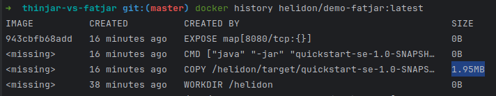
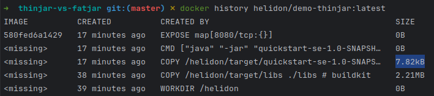
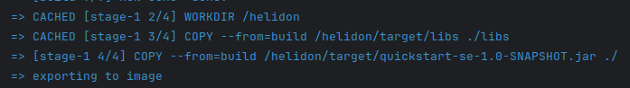
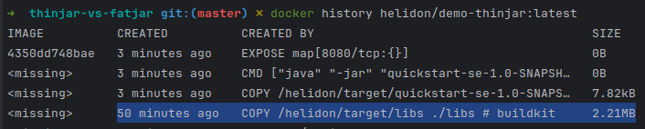
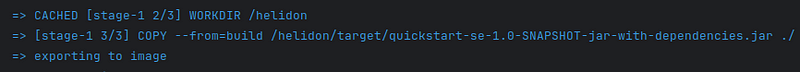
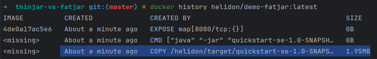

FatJars have been with us for a long time now. At first, it enabled all the Java apps to be distributed as a single jar archive, without any hassle about the dependency jars. But how is that achieved? By repackaging all the dependencies! Repackaging not only breaks Java module system, but also considerably slows down your CI/CD pipeline!

## FatJar
Fatjar is a way of packaging java application in the single jar, all classes from all the dependencies are repackaged in a single new jar.



Pros:
* Easy distribution and deployment

Cons:
* One large archive
* Unable to exclude third party dependencies
* Forces us to create a large container image layer
* Breaks Java modules
* Breaks CDI beans archive descriptors

## ThinJar
ThinJar is just a fancy name for good old keeping all your dependencies in accompanying /lib folder. Very same approach as statically linked libraries in C programs.



Pros:
* Exclusion of the third party dependencies is easy
* Small jar archive
* Fine-grained container image layering
* Java modules friendly
* CDI archives friendly

Cons:
* More hassle when setting up the classpath

## Container image
Who is who becomes clear when creating a container image. While with FatJar, you have no choice and need to copy whole jar at once:

```dockerfile
COPY --from=build /helidon/target/quickstart.jar ./
```

With thinjar, you can copy the dependencies to the container image in a standalone step.

```dockerfile
COPY --from=build /helidon/target/libs ./libs
COPY --from=build /helidon/target/quickstart.jar ./
```

As the dependencies are being copied to the container image in a standalone step, it also gets cached separately. Next time, you fix something and just change the business code. You don't actually need to push all the unchanged dependencies to your image repository. You push just a small archive, saving your time and bandwidth.
Let's compare it with a quick demo.

```bash
git clone git@github.com:danielkec/thinjar-vs-fatjar.git
cd thinjar-vs-fatjar
docker build -t helidon/demo-thinjar . -f Dockerfile
docker build -t helidon/demo-fatjar . -f Dockerfile.fatjar
```

When we compare history of each image:

```bash
docker history helidon/demo-fatjar:latest
```

We can see that FatJar creates a single 2Mb large layer.



While ThinJar creates two layers, large one with dependencies only, and small one with just the business code.

```bash
docker history helidon/demo-thinjar:latest
```



Now let's do just a small change.

```bash
# Just change the app.greeting config property
sed -i "s/^app.greeting=.*/app.greeting=Bonjour/" src/main/resources/application.properties
```

Rebuild the ThinJar docker image.

```bash
docker build -t helidon/demo-thinjar . -f Dockerfile
```

From the build output you can already see that ThinJar image cached all the dependencies because nothing changed there.





While FatJar image have to create a new layer with all the dependencies again.

```bash
docker build -t helidon/demo-fatjar . -f Dockerfile.fatjar
```





Single small change in a super small FatJar packaged application forces you to unnecessarily push 2Mb? 

Can you hear devops complaining already?

## Conclusion
ThinJar is far more suitable for microservice development, pushing changes to remote repositories will be faster and your CI/CD pipelines happier!
Helidon is from the start designed to be delivered in a thinjar, just try out Helidon's starter, everything works out of the box.
Let our New Year's resolution to be this: Use ThinJar! Our devops will be grateful.


