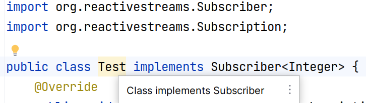
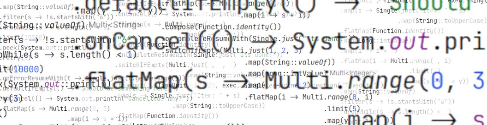
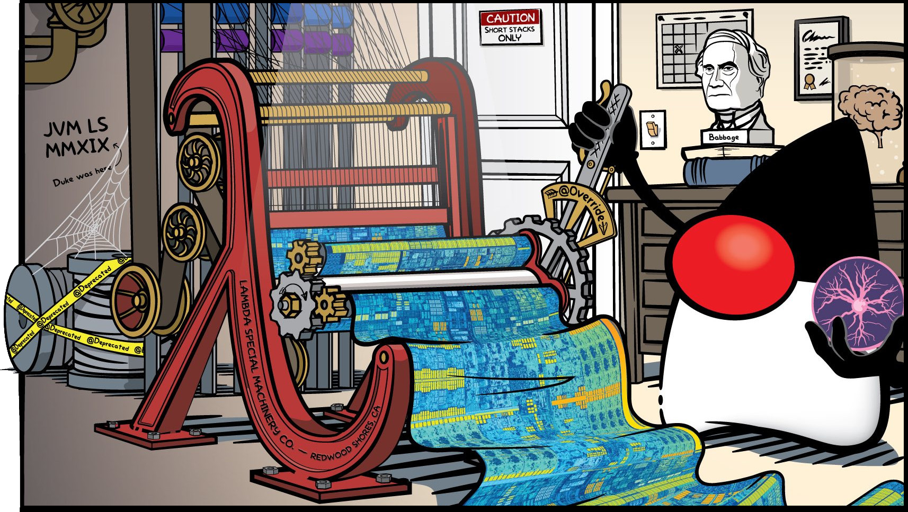
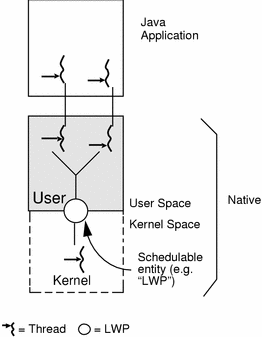
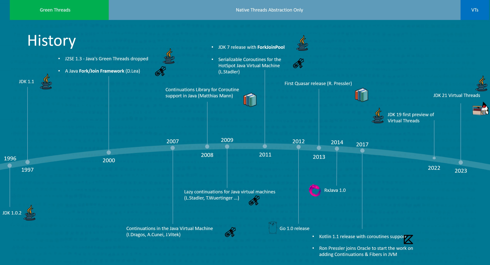
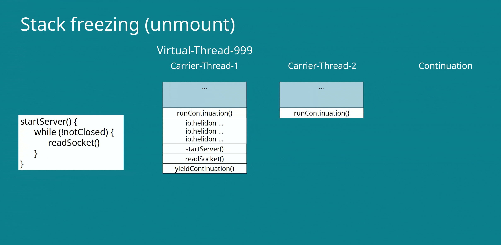
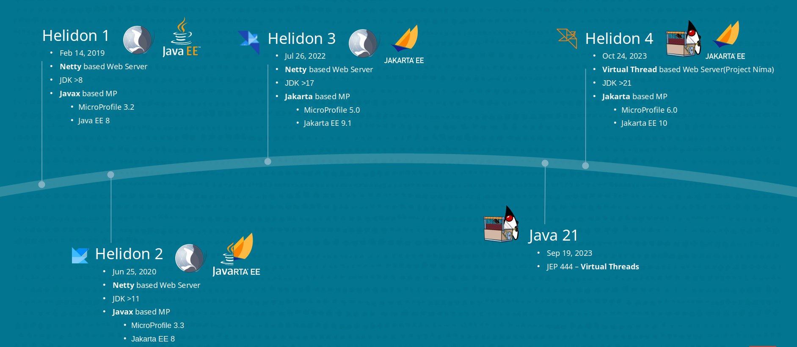
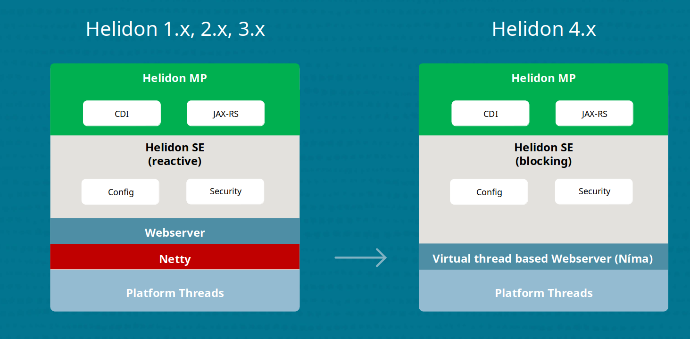
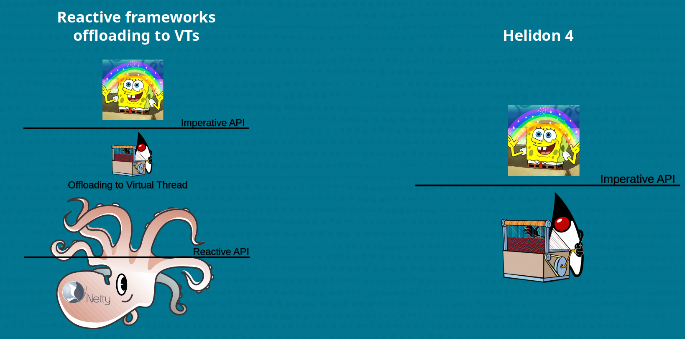

A lot has been written about Virtual Threads in Java, but what is the real-life usage, 
where do they excel?
Let's take a look at Virtual Threads from a webserver perspective.

 * [Expensive Threads](#expensive-threads)
 * [Non-Blocking code](#non-blocking-code)
 * [Reactive Operators](#reactive-operators)
 * [Virtual Threads](#virtual-threads)
 * [Helidon 4](#helidon-4)
 * [Conclusion](#conclusion)

## Expensive Threads
Starting kernel thread is very expensive, that is a performance problem for all webservers. 
Every kernel thread created by JVM needs megabytes of memory, and not just any memory, off-heap memory!
It takes quite a time to create a physical thread, a lot of memory is required which we can't really limit of manage  
We did overcome that by pooling the threads so we can reuse those already started.


 
But using thread pools is not enough, as webserver usually need more threads than there is available CPUs, 
the threads needs to take turns on the available cores. They need to be organized and scheduled
to run on CPUs.

Scheduling of the kernel threads on the CPU is done by operating system scheduler,
and as you can imagine, OS scheduler is pretty busy. To help with effective work scheduling 
the threads can cooperatively *yield* each time there is nothing to do, like when waiting for IO to respond
or when sleep instruction is executed. Or thread is preemptively interrupted to achieve effective time-slicing. 
So instead of "burning CPU" just to wait, other threads have a chance to run it's business on the CPU. 

Scheduler exchanges the threads running on the CPU in a process known as 
[Context switching](https://en.wikipedia.org/wiki/Context_switch), 
during this process a lot of bureaucracy needs to be done to keep the thread state for later 
and it's a lot of work to move around registers and stack pointers.
As you can imagine this process can be quite expensive and get even more expensive whe we have 
a lot of physical threads.

## Non-Blocking code
For that reason we have been trying to come up with a way of scheduling work directly in Java ourselves.
We know way better the context of what needs to be executed and when. By scheduling the work ourselves
we can keep low amount of physical threads very, very busy, **not letting them block** and therefore not giving
them much chance for context-switching.

To avoid blocking, asynchronous coding needs to be used. 
Code newer waits for anything, each result we need to wait for is executed on different thread.
Instead of blocking, callback function needs to be provided, so some other thread can execute it.

As a direct result of avoiding blocking, we are loosing natural backpressure. 
You need to think about, how to signal the calling side, that we are unable to process more callbacks,
how to do a flow-control.

Callbacks are executed on different threads, order of execution is ... there is no order. 
The situation is called callback hell, and for taming it, to manage and work with callbacks `reactively`, 
we can use Reactive Operators.

## Reactive Operators
Reactive Streams is a set of APIs for orchestration of callbacks with built-in backpressure mechanism.
API is even part of the JDK since Java 9, 
you can find it in [java.util.concurrent.Flow](https://docs.oracle.com/en/java/javase/21/docs/api/java.base/java/util/concurrent/Flow.html) class.
It brings order to the callback hell by a set of very strict rules,
but be aware, while the interfaces seems to be fairly simple, 
the [specification](https://github.com/reactive-streams/reactive-streams-jvm/blob/master/README.md) rules are ridiculously complicated.
So complicated that when you try to implement the interfaces yourself IntelliJ warns you off!



Instead of implementing it, you can use already existing, highly optimized libraries providing reactive primitives 
with operators implementing Reactive Streams, usually in a builder like pattern. 

Just to mention few:

 * [RxJava](https://github.com/ReactiveX/RxJava) - Famous library from [David Karnok](https://github.com/akarnokd).
 * [Reactor](https://github.com/reactor/reactor-core) - Implementation that comes with Spring also from David Karnok among others .
 * [Service-Talk](https://github.com/apple/servicetalk) - Apple's implementation.
 * [Helidon](https://helidon.io/docs/v4/se/reactivestreams/engine) - Our own Helidon implementation also contributed by David Karnok. 
 * [Mutiny](https://quarkus.io/guides/mutiny-primer) - Quarkus, RedHat.

Reactive handler for HTTP GET method in Helidon 3 SE used to look like this:
```java
.get("/callOtherService", (req, res) -> {
    // Server thread is used just for sending request and setting up the callback
    seClient.get()
            .request(JsonObject.class)
            .map(jo -> jo.getString("status"))
            .map(String::toUpperCase)
            .onError(res::send)
            .forSingle(s -> {
                // When client response comes on it’s own thread, 
                // callbacks in reactive operators converts it and send the response.
                // Server response is actually sent by client’s thread!
                res.send(s); 
            });
            // Server thread doesn’t wait for anything and is released/yielded back to event-loop
        })
```
No blocking was allowed, for calling another service, reactive client had to be used. 
You can see the operator usage in above example as Helidon's APIs used reactive operators.

With reactive paradigm our Java experience changed in to somewhat more manageable callback orchestration, 
our code started to resemble source code from the "Matrix" movie.



Sadly, unlike in the movie, you won't start to see the meaning in the code if you stare at reactive operators long enough.
Actually if you bump in to your own reactive code after few weeks, it's hard to figure out what is going on.
Reactive programming has a steep learning curve, it is very hard to maintain and debug.
And if you need to use blocking code, you need to start a new thread and offload the blocking operation to it.


Just imagine how hard it is to explain your reactive codebase to a new junior intern who just joined your company.
And how much easier it would be to explain simple imperative-blocking code base!

## Virtual Threads
With Virtual Threads it gets easy again, Virtual Threads are doing exactly same trick, 
avoiding Context Switching by moving the work scheduling to JVM. Closer to the context of our 
JVM workload, but it is no longer a job of developers to plan it with callbacks like with reactive programming. 



With Virtual Threads you get the same performance advantages like with reactive coding, 
just the coding part is much nicer since you can use the imperative coding style, and the magic happens behind the scenes.

Let's get back to our example, this time with Helidon 4 SE, again we have a handler for HTTP GET method.
This time the code is blocking, easy to understand and debug. Definitely easier to explain to someone.

Imperative handler for HTTP GET method in Helidon 4 SE:
```java
.get("/callOtherService", (req, res) -> {
        // Server virtual thread is blocked until response is received
        String status = nimaClient.get()
                .request(JsonObject.class)
                .getString("status");
        
        // When client response comes, original handler thread continues
        String upperCaseStatus = status.toUpperCase();
        
        // Original thread is used for sending response
        res.send(upperCaseStatus);
    });
```

Because all Helidon 4 handlers are executed on virtual threads, blocking the thread is not a problem. 
In above example when client is blocking Virtual Thread until it receive response, virtual thread 
**yields** it's "Carrier Thread" so it can be used by other virtual thread. How does that work?

Let's take a look in [java.lang.Thread](https://github.com/openjdk/jdk/blob/672c413c61d9b155020a0fd4bd1c2bc0661a60fb/src/java.base/share/classes/java/lang/Thread.java#L479) 
how for example sleep instruction does something else for virtual threads:
```java
public static void sleep(long millis) throws InterruptedException {
    if (millis < 0) {
        throw new IllegalArgumentException("timeout value is negative");
    }
    long nanos = MILLISECONDS.toNanos(millis);
    sleepNanos(nanos);
}

private static void sleepNanos(long nanos) throws InterruptedException {
        ThreadSleepEvent event = beforeSleep(nanos);
        try {
            if (currentThread() instanceof VirtualThread vthread) {
                vthread.sleepNanos(nanos);
            } else {
                sleepNanos0(nanos);
            }
        } finally {
            afterSleep(event);
        }
    }
```

If you follow that a little deeper in [java.lang.VirtualThread](https://github.com/openjdk/jdk/blob/672c413c61d9b155020a0fd4bd1c2bc0661a60fb/src/java.base/share/classes/java/lang/VirtualThread.java#L540), you are going to find `yieldContinuation()` method.

```java
   /**
     * Invokes Continuation.yield, notifying JVMTI (if enabled) to hide frames until
     * the continuation continues.
     */
    @Hidden
    private boolean yieldContinuation() {
        notifyJvmtiUnmount(/*hide*/true);
        try {
            return Continuation.yield(VTHREAD_SCOPE);
        } finally {
            notifyJvmtiMount(/*hide*/false);
        }
    }
```

And that is the trick, Virtual Threads are implementation of **Continuations** in Java, and all known blocking operations in JDK
are aware of them! Ha! Feature that Go developers have for some time now is finally available in Java!

Actual scheduler used for mounting virtual threads on top of a physical threads(called by fancy term "carrier threads")
is a marvelous and battle-proven piece of code [ForkJoinPool](https://github.com/openjdk/jdk/blob/672c413c61d9b155020a0fd4bd1c2bc0661a60fb/src/java.base/share/classes/java/lang/VirtualThread.java#L1416). 

### Green Threads
The history of ForkJoinPool is quite cool, and it stretches all the way back to the time when Green Threads have been removed from JDK.
[Green threads](https://en.wikipedia.org/wiki/Green_thread) were very similar to modern virtual threads, 
but there was a big difference. Green threads were scheduling work over single physical thread. 
So the tasks never really ran in parallel, they were just multiplexing over a single physical thread.



Green Threads have been eventually removed in 2000 with release of JDK 1.3, and we got stuck with physical threads abstraction.
But as you can see from the timeline below, [Doug Lea](https://en.wikipedia.org/wiki/Doug_Lea) - Java Concurrency demigod, 
didn't wait for anything and published his paper [Java Fork/Join Framework](https://www.researchgate.net/publication/2609854_A_Java_ForkJoin_Framework).
Doug Lea's implementation of the [ForkJoinPool](https://docs.oracle.com/en/java/javase//21/docs/api/java.base/java/util/concurrent/ForkJoinPool.html) found its way to JDK in 2011 with JDK 7 release. 



Now, since JDK 21 release, we have Continuations in Java and scheduling is done by ForkJoinPool. 
But it still sounds like a context switching right? It still is, but this time it doesn't have to be so abstract, 
and we have battery of cool performance tricks available. 
Instead of expensive OS scheduled context switching, we have highly performant scheduling tailored to the Java runtime needs.

### Freezing and Thawing
The process of mounting and unmounting Virtual Thread context from carrier threads is called Thawing and Freezing.
We can find some very cool performance tricks making Virtual Threads so effective there.

Let's show it on a hypothetical simplistic server, we can call it for example Helidon 😊:

```java
startServer() {
    while (!notClosed) {
        readSocket();
    }
}
```

It's a very typical endless conditional loop calling repeatedly blocking method `readSocket()`,
stack of socket will look something like this:
```properties

runContinuation()
io.helidon....
io.helidon....
io.helidon....
startServer()
readSocket()
yieldContinuation()
```
Each time there are no new data available on the socket `yieldContinuation()` is going to be reached by virtual thread and 
virtual thread is going to be unmounted from carrier thread. Its context is going to be frozen until the virtual thread is 
scheduled to run again on some of the carrier threads and the context is thawed.

Cool part is that we don't have to save and freeze whole stack, only the part related to the virtual thread.
But that is not all, we also don't have to move around all the frames, as you can see, our hypothetical server
rarely reaches outside the endless loop and blocking also happens mainly in the loop. So optimizing 
thawing process to freeze/thaw only the part of the stack related to the calls inside the loop offers itself.

It is done with a [return barrier](https://github.com/openjdk/jdk/blob/672c413c61d9b155020a0fd4bd1c2bc0661a60fb/src/hotspot/share/runtime/continuationFreezeThaw.cpp#L129),
that is a stack frame surrogate which lazily thaws more stack frames(stack chunks) when needed. 



That way even smaller part of the stack is being moved around.
And that is not all, frozen stack chunks stored in heap are being 
compressed when not used, further reducing the memory needed for running our
little hypothetical server.

All these behind the scenes tricks are there to give us back imperative 
coding style, so we can concentrate on the business problems instead 
of complicated reactive code style. It is a same performance trick, 
just easier to use.


# Helidon 4
Helidon is a server, high concurrency is it's daily bread. As we already 
stated above in the article, avoiding expensive context switching is paramount for 
Helidon to provide the best possible starting point for business code.

Helidon used to be a reactive runtime based on famous [Netty](https://netty.io/) library.
Netty is extremely fast and performant library for using sockets asynchronously in Java.
That is great for webservers with one steep downside, as Netty is asynchronous it's
APIs are considerably complicated, that is why all the Netty based runtimes are reactive.
But reactive APIs are viral, you can't abstract them away without loosing performance.
For this reason we have been looking for Virtual Threads coming to Java with great hopes.
Right after release of Java 21, we have released Helidon 4 fully leveraging this new exciting 
feature.



For Helidon 4 we have developed brand new webserver to avoid the necessity 
to use reactive APIs for gaining performance.
This new webserver with code-name `Níma` is based on Virtual Threads
and **completely replaces Netty**.



It brings performance on par with Netty based reactive runtimes,
while using simple imperative coding style. Using Virtual Threads
simply for allowing blocking code would be possible even with Netty
by offloading work to Virtual Threads from reactive handlers, 
and that's what "Virtual Threads support" means in many Netty based
runtimes.



Not in Helidon, Helidon 4 is using blocking - imperative code from the ground up.
All the way from socket to your handler, webserver is almost absurdly simple
in comparison with extremely complicated reactive webservers.
This simplicity is only possible thanks to Virtual Threads allowing 
blocking code to avoid expensive context switches without all the pain 
of using reactive APIs.

# Conclusion
Virtual Threads are doing the same trick as reactive coding without the burden of additional complexity.
Like with reactive code, Virtual Threads are not a silver bullet for solving all your performance issues.
It won't make your CPU magically faster, it just removes a lot of bureaucracy which is slowing you down
in use-ceases with high contention and blocking. Use-cases typical for webservers.