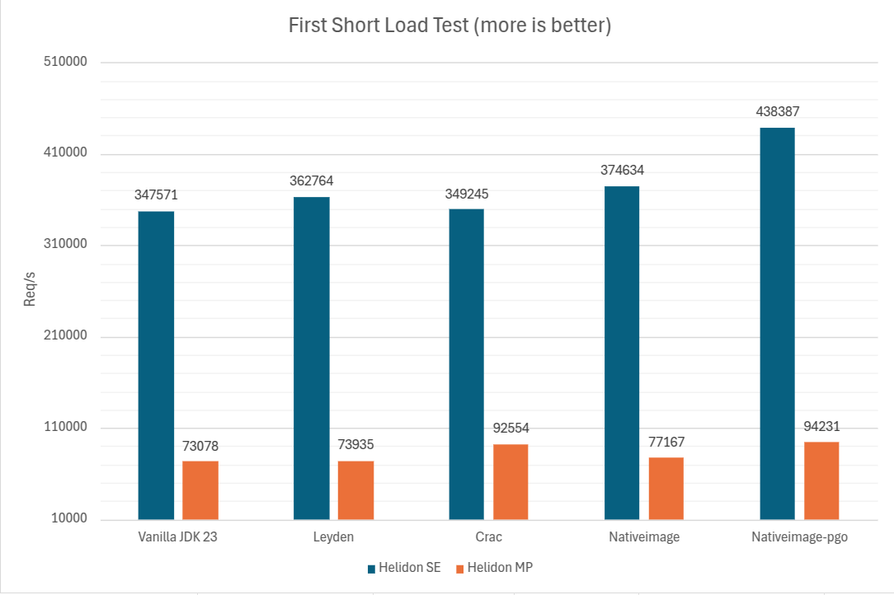
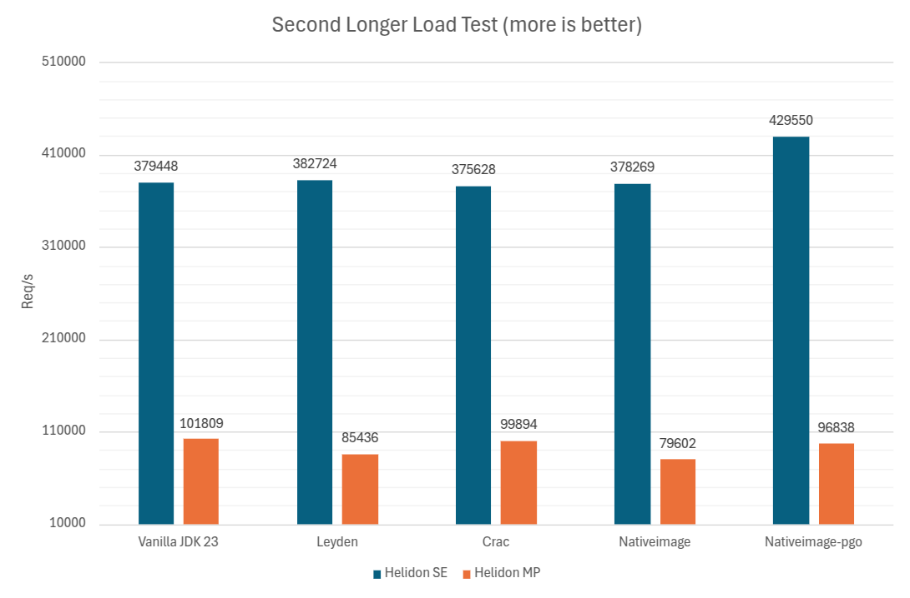

# Helidon and AOT startup optimization benchmark
_Leyden vs. NativeImage vs. CRaC, which makes Helidon start faster?_

It is a great time to be a Java developer! Java ecosystem is thriving, and we have so many great tools to choose from.
There is an old cliché about Java long startup time. It's not true anymore, but yes it can take some
time to get at the full power after our Java application started. It's by design, Java applications are utilizing 
JIT, Just In Time compilation to the native code. This is happening at runtime and with a good reason, 
because based on the workload, JIT can actually optimize compiled native code. And what is more, it can do it 
speculatively! Rollback previous optimizations if it's heuristics find the way it can be optimized better, based 
on change in the workload for example.

But there are ways how we can speed up the startup and the warming up phase dramatically. Three most promising 
technologies available are:
- [Leyden project](https://openjdk.org/projects/leyden/)
- [GraalVM Native Image](ttps://www.graalvm.org/latest/reference-manual/native-image/)
- [Coordinated Restore and Checkpoint (CRaC)](https://crac.org/)

## Leyden
As written on the project page, primary goal of [OpenJDK project Leyden](https://openjdk.org/projects/leyden/) is to improve the startup time, 
time to peak performance, and footprint of Java programs.
It uses several approaches for achieving the goal, but the most interesting with the latest [EA build](https://jdk.java.net/leyden/) is 
caching the optimization data in CDS(Cached Data Storage) files. You can start your application for 
a CDS recording [training run](https://openjdk.org/projects/leyden/notes/05-training-runs),
do a "warmup" and then save the CDS archive for later use. When you use it, your application starts way faster and already optimized!


## GraalVM Native Image
[GraalVM Native Image](https://www.graalvm.org/latest/reference-manual/native-image/) is a technology coming from [Oracle Labs](https://labs.oracle.com/) 
to provide a way of AOT native compilation, it means that you create a platform dependent binary. You don't need JDK to run it and 
its starts almost instantly as most of the loading and starting actually happened during the AOT build time.
There is small drawback as Native Image binaries don't have JIT(nothing more to compile), and AOT optimizations
can't really optimize for actual workload.

But there is another card in the stack of cool features [GraalVM](https://www.graalvm.org/) has in its pocket, you can do AOT compilation twice!
It is called [Profile-Guided Optimization(PGO)](https://www.graalvm.org/latest/reference-manual/native-image/guides/optimize-native-executable-with-pgo/),
it provides a way of doing first AOT compilation, then instrumented warmup training - similar to Leyden training, 
and use training profile data stored in the iprof file for a second AOT compilation. 

## CRaC
[Coordinated Restore and Checkpoint (CRaC)](https://crac.org/) is a way of snapshotting running JVM. 
It is a technology coming from [Azul Systems](https://www.azul.com/products/components/crac/) and was until 
recently based on [CRIU](https://criu.org) a project to implement checkpoint/restore functionality 
for Linux(you are probably using it very often with Podman or Docker).
Not long ago a [new CRaC engine called Warp](https://foojay.io/today/warp-the-new-crac-engine/) was introduced by Azul 
and that brings very exciting ability to do snapshotting in a docker build phase.


# Helidon
Helidon is a microservice framework, and it matters if you can start your pod fast, you can scale up more effectively
and avoid burning more resources than necessary. We have supported [GraalVM Native Image](https://helidon.io/docs/v4/mp/guides/graalnative) for years now, but as there are 
more players in the field, **[Helidon 4.2.0 adds support for CRaC](https://helidon.io/docs/v4/mp/guides/crac)**. 
Leyden don't need a any special support at all so you can easily use any of the available 3 options, 
and it also provides unique opportunity to benchmark AOT optimizations with Helidon application!

Before we get to the results lets introduce the way of benchmarking we have chosen.
To make the benchmark close to business like use-case, we will do the warmup/training 
during docker build phase. That is actually a very cool way how to leverage AOT optimization,
simply by creating a Docker image with AOT pre-trained Helidon application.


# Benchmarking AOT with Helidon
Benchmark is prepared as a set of docker files, each creating docker image with AOT pre-warmed Helidon application,
application is a very simple Hello World example. Image is always created each time for both flavors of Helidon,
super fast, super simple SE flavor and heavyweight full CDI powered MP. For having a baseline vanilla OpenJDK 
version is measured too.

Native Image is measured twice, normal AOT build without warmup/training 
and build with [Profile-Guided Optimization(PGO)](https://www.graalvm.org/latest/reference-manual/native-image/guides/optimize-native-executable-with-pgo/).

- Vanilla - Clean OpenJDK with no AOT warmup as a baseline
- Leyden - Leyden project [EA build](https://jdk.java.net/leyden/) with warmup/training during build phase
- Native Image - [GraalVM Native Image](https://www.graalvm.org/latest/reference-manual/native-image/) no warmup just AOT native image binary build in Docker build phase
- Native Image [PGO](https://www.graalvm.org/latest/reference-manual/native-image/guides/optimize-native-executable-with-pgo/) - native image binary with profile guided optimization warmup/training in Docker build phase
- CRaC - [Coordinated Restore and Checkpoint (CRaC)](https://crac.org/) CRaC snapshot created during Docker build phase

Lets break down what is measured and when, first we do a measurement in the build phase, measuring how long it takes to build 
the application with the AOT, how fast it starts for warmup and how many requests per second it manages to handle during the warmup/training.
Second, we measure the startup time of the optimized application, 
then we do short 5 second load test with [wrk tool](https://github.com/wg/wrk) to figure out how actually pre-warmed is our
freshly started application. The test is only 5 seconds long, so we don't give JIT compiler much time to further optimize.
Last test is another wrk load test, this time for 15 second to se if application can optimize further.


### Build phase:
- **Warmup start** - measuring how long it takes to start the app for the training/warmup, instrumented or not
- **Warmup req/s** - measuring how many requests per seconds is application able to serve during the warmup using [wrk tool](https://github.com/wg/wrk) `wrk -c 20 -t 10 -d 20s http://localhost:8080`
- **AOT/build sec** - measuring the build phase time in seconds, including warmup/training which takes 20 seconds

### Run phase:
- **Startup ms** - measuring startup time of the AOT optimized pre-warmed application
- **5s run req/s** - first short requests per second measurement,
  5 seconds long designed to show how optimized application is right after start,
  before JIT has the chance optimize much further.
  wrk parameters used: `wrk -c 20 -t 10 -d 5s http://localhost:8080`
- **15s run req/s** - second longer requests per second measurement,
  meant to show if and how is application able to optimize further during the runtime.
  wrk parameters used: `wrk -c 20 -t 10 -d 15s http://localhost:8080`


## Results
Here are the results, and we can see its quite interesting.  

```markdown
Name                     |   AOT/build sec| Warmup start ms| Warmup req/s|  Startup ms| 5ss run req/s| 15ss run req/s
----------------------------------------------------------------------------------------------------------------------
Crac se                  |           16.06|             384|    369144.07|          20|     349244.56|     375627.50
Leyden se                |           28.99|             531|    366131.32|         126|     362764.13|     382723.54
Nativeimage se           |           50.70|                |             |           8|     374634.48|     378269.27
Nativeimage-pgo se       |          114.04|              38|    247108.15|           6|     438387.36|     429550.39
Vanilla se               |            5.73|                |             |         383|     347570.57|     379447.77
Crac mp                  |           17.62|            1620|     95163.17|          32|      92553.57|      99893.59
Leyden mp                |           82.71|            3374|     88586.15|         615|      73935.23|      85436.14
Nativeimage mp           |           96.47|                |             |          37|      77167.15|      79602.40
Nativeimage-pgo mp       |          239.37|             142|     27249.80|          31|      94230.85|      96838.39
Vanilla mp               |           11.64|                |             |        1597|      73078.18|     101808.88
----------------------------------------------------------------------------------------------------------------------
Results stored in /tmp/startup-benchmark-1741357244/results.csv
```

### AOT optimized startup time
First and most interesting is the startup time, 
how is AOT optimization helping? Less is better. Out of all the options Native Image with PGO seems to be the fastest,
with normal Native Image and CRaC closely following. You can however notice that with more heavyweight 
MP version of our application the race is much closer. Leyden takes longer but still cuts the startup 
time in more than half, and that is quite impressive too, especially because no special support in 
Helidon nor in the app itself is really needed.


### Short load test
And how is our AOT optimized application doing with performance right after start?
This time more is better, more requests per second means more powerful application we have.
First short test is meant to test the performance before JIT optimization has a chance to 
optimize any further. 

Once again Native Image with PGO is leading the race with Helidon SE application. Native Image with 
CRaC following closely. This time, with larger Helidon MP application, is situation changing 
on second place and CRaC is getting faster than Native Image without PGO.



### Long load test
Second test gives some more time to the JIT to further optimize. Interesting is that Native Image with PGO 
still leads, but normal Native Image gets behind Vanilla JDK and Leyden. Yes JDK without any extra AOT
is catching on already! And with heavier Helidon MP application JDK takes down even the Native Image with PGO!



### AOT build time
How long it gets to actually do a build with AOT optimization? Now shorter is better. 
This is where JDK without AOT obviously shines. From the AOT options CRaC is the winner, 
creating the snapshot is fast. Instrumented runs of Leyden and compiling everything in advance in case of Native Image is 
time-consuming.


### Conclusion
All the options are actually super cool, Java ecosystem is after 30 years livelier than ever! There is some 
interesting findings in this benchmark. 

 - **Leyden** - Build we have tested is still EA, and it gets better and better. What is most interesting is that 
from all the options, Leyden doesn't need any special treatment from your application or libraries you are using.

 - **Native Image** - I was quite surprised by PGO performance! Those numbers just speak for themselves.
What can get little tricky is making your application compatible with Native Image, it can take some time 
to figure out what should be invoked at build time and what not, where is reflection used so aggressive tree-shaking
doesn't throw away something important and so on. Also from all the options, native image binary is the only one
which doesn't need JDK to run, that can make you docker images tiny and efficient. 

 - **CraC** - CRaC has got really cool with new Warp engine, now you can do snapshot even in the docker build!
Have to look for any opened IO and close it before snapshot is done. Also application is performing just like
normal JDK run app before snapshotting unlike the instrumented runs of Leyden or Native Image PGO.

   
Your Helidon application can start even faster, your pods scale quicker, and you got quite some options! 


[Benchmark project](https://github.com/helidon-io/helidon-labs/tree/main/benchmarks/startup) can be found in 
[Helidon Labs repository](https://github.com/helidon-io/helidon-labs). Benchmark execution was 
done on [OCI](https://www.oracle.com/cloud/) VM.Standard3.Flex VM with following specs.
```yaml
Image:               Oracle-Linux-8.10-2025.01.31-0
Model name:          Intel(R) Xeon(R) Platinum 8358 CPU @ 2.60GHz
Architecture:        x86_64
CPU(s):              32
Memory (GB):         64
```

